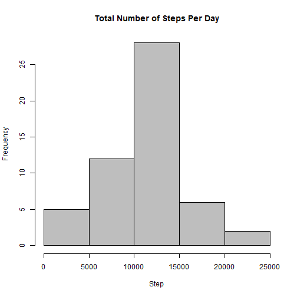
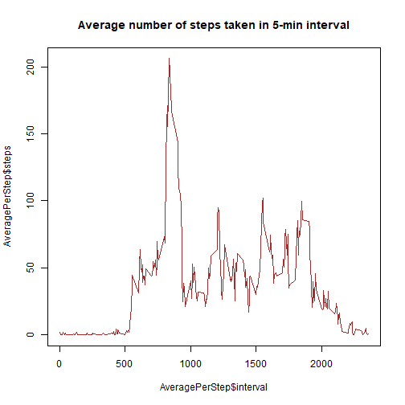
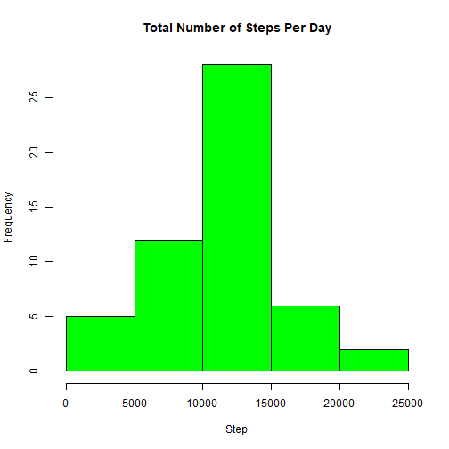
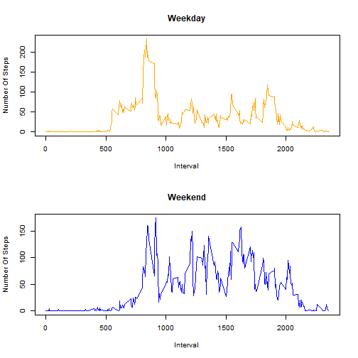

```r
library(datasets)
library(knitr)
library(markdown)
library(timeDate)

### Loading And Reading The Data
link<-"https://d396qusza40orc.cloudfront.net/repdata%2Fdata%2Factivity.zip"
fn<-"repdata_data_activity.zip"
download.file(link,fn)
unzip(fn)
a<-read.csv("activity.csv")
head(a,3)
```

```
##   steps       date interval
## 1    NA 2012-10-01        0
## 2    NA 2012-10-01        5
## 3    NA 2012-10-01       10
```

```r
### Calculating The Total Number Of Steps Taken Each Day And The Average Number Of Steps Taken Of The 5-minute Interval
StepPerDay<-aggregate(steps~date, a, sum)
AveragePerStep<-aggregate(steps~interval, a, mean)
head(StepPerDay,3)
```

```
##         date steps
## 1 2012-10-02   126
## 2 2012-10-03 11352
## 3 2012-10-04 12116
```

```r
head(AveragePerStep,3)
```

```
##   interval     steps
## 1        0 1.7169811
## 2        5 0.3396226
## 3       10 0.1320755
```

```r
### Making A Histogram And Calculating The Mean And Median Total Number Of Steps Taken Per Day
hist(StepPerDay$steps, col="grey", xlab="Step", main="Total Number of Steps Per Day")
```



```r
MeanMedian<-c(mean(StepPerDay$steps),median(StepPerDay$steps))
names(MeanMedian)<-c("Mean","Median")
MeanMedian
```

```
##     Mean   Median 
## 10766.19 10765.00
```

```r
### Make A Time Series Plot Of The 5-minute Interval
with(data=AveragePerStep, plot(x=AveragePerStep$interval,y=AveragePerStep$steps, type="l", col="brown"))
title(main="Average number of steps taken in 5-min interval")
```



```r
max(AveragePerStep$steps)
```

```
## [1] 206.1698
```

```r
### Making A Subset
SubData<-subset(AveragePerStep,steps==max(AveragePerStep$steps))
head(SubData,3)
```

```
##     interval    steps
## 104      835 206.1698
```

```r
SubData$interval
```

```
## [1] 835
```

```r
### Creating A New Column "Newsteps"
a$Newsteps<-AveragePerStep$steps
a$Newsteps[is.na(a$Newsteps)]<-a$Newsteps
a$Newsteps<-NULL
head(a$Newsteps,3)
```

```
## NULL
```

```r
NewData<-a
head(NewData,3)
```

```
##   steps       date interval
## 1    NA 2012-10-01        0
## 2    NA 2012-10-01        5
## 3    NA 2012-10-01       10
```

```r
### Using The New Data Subset To Calculate The Total Number Of Steps Per Day
SumData<-aggregate(steps~date, NewData, sum)
head(SumData,3)
```

```
##         date steps
## 1 2012-10-02   126
## 2 2012-10-03 11352
## 3 2012-10-04 12116
```

```r
hist(SumData$steps, col="green", xlab="Step", main="Total Number of Steps Per Day")
```



```r
MeanMedian2<-c(mean(SumData$steps),median(SumData$steps))
names(MeanMedian2)<-c("Mean","Median")
MeanMedian2
```

```
##     Mean   Median 
## 10766.19 10765.00
```

```r
### Using The isWeekday() Function To Check
NewData$Weekday<-isWeekday(NewData$date)
head(NewData,3)
```

```
##   steps       date interval Weekday
## 1    NA 2012-10-01        0    TRUE
## 2    NA 2012-10-01        5    TRUE
## 3    NA 2012-10-01       10    TRUE
```

```r
### Subset And Calculate The Average Steps For Weekday And Weekend
WeekDay<-subset(NewData, NewData$Weekday=="TRUE")
WeekDayMean<-aggregate(steps~interval, WeekDay, mean)
head(WeekDayMean,3)
```

```
##   interval     steps
## 1        0 2.3333333
## 2        5 0.4615385
## 3       10 0.1794872
```

```r
Weekend<-subset(NewData, NewData$Weekday=="FALSE")
WeekendMean<-aggregate(steps~interval, Weekend, mean)
head(Weekend,3)
```

```
##      steps       date interval Weekday
## 1441     0 2012-10-06        0   FALSE
## 1442     0 2012-10-06        5   FALSE
## 1443     0 2012-10-06       10   FALSE
```

```r
### Make The Panel Plot
layout(matrix(c(1,1,2,2), 2, 2, byrow = TRUE))
plot(x=WeekDayMean$interval, y=WeekDayMean$steps, xlab="Interval", ylab="Number Of Steps", main="Weekday", type="l", col="orange")
plot(x=WeekendMean$interval, y=WeekendMean$steps, xlab="Interval", ylab="Number Of Steps", main="Weekend", type="l", col="blue")
```


